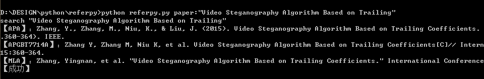

# ReferPy
在论文写作中，参考文献是非常重要的一部分，但是花费过多时间在参考文献的格式上，往往得不偿失。本项目利用[百度学术](http://xueshu.baidu.com/)的查询功能，通过Http请求。<br>
当前接口支持获取百度学术所提供的`所有`[参考文献引用格式]()：
* APA
* MLA
* GBT7714
后期有时间会支持Google学术，知网等更其他搜索引擎，也会建设Web网站，提供查询接口。

## 一、安装
本项目是通过Python脚本编写的，在Windows系统下需要配置Python环境：
* Python<br>
	请点击[这里](https://www.python.org/downloads/)查看安装列表。尽量采用Python3.6及其以上版本(本项目开发环境采用Python 3.7.0a4).安装完毕后，请在命令行用以下命令测试安装是否成功，若安装成功则返回版本信息：
	```
	Python -V
	```
* BeautifulSoup<br>
	这是一个Python的第三方工具包，用于对html网页进行解析。通过python的pip工具包可以进行自动下载安装。
	```
	pip install beautifulsoup4
	```
* ReferPy
	下载[ReferPy压缩文件](/lsj9383/referpy/archive/master.zip)，在你愿意的地方解压开来即可。
	
## 二、接口
ReferPy的接口的使用是通过命令行，ReferPy将会发起http请求访问百度学术，并获得解析返回的结果。注意，由于需要联网，因此要确保`网络环境畅通`。
```
python refer.py <paper> [-DEBUG|-debug|-D|-d]
```
### *1.直接查询*
ReferPy在`命令行`中直接输入一个指定论文，并在`命令行`直接显示该论文的参考文献引用格式：
```
python refer.py paper:"A data hiding scheme based upon DCT coefficient modification"
```
将会查询论文A data hiding scheme based upon DCT coefficient modification的文献引用格式，如下图所示：

### *2.批量查询*

### *3.DEBUG模式*

## 三、FAQ


## 四、参考文献引用格式