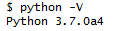
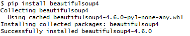

# ReferPy
在论文写作中，参考文献是非常重要的一部分，但是花费过多时间在参考文献的格式上，往往得不偿失。本项目利用[百度学术](http://xueshu.baidu.com/)的查询功能，通过Http请求。<br>
后期有时间会支持Google学术，知网等更其他搜索引擎，也会建设Web网站，提供查询接口。

## 一、安装
本项目是通过Python脚本编写的，在Windows系统下需要配置Python环境：
* Python<br>
	请点击[这里](https://www.python.org/downloads/)查看安装列表。尽量采用Python3.6及其以上版本(本项目开发环境采用Python 3.7.0a4).安装完毕后，请在命令行用以下命令测试安装是否成功，若成功返回版本信息：
	```
	Python -V
	```
	
* BeautifulSoup<br>
	这是一个Python的第三方工具包，用于对html网页进行解析。通过python的pip工具包可以进行自动下载安装。
	```
	pip install beautifulsoup4
	```
	
	
## 二、接口

### *1.直接查询*

### *2.批量查询*

### *3.DEBUG模式*

## 三、FAQ

